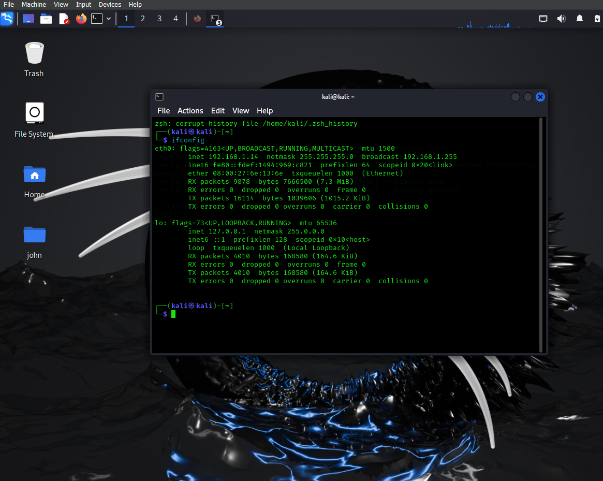
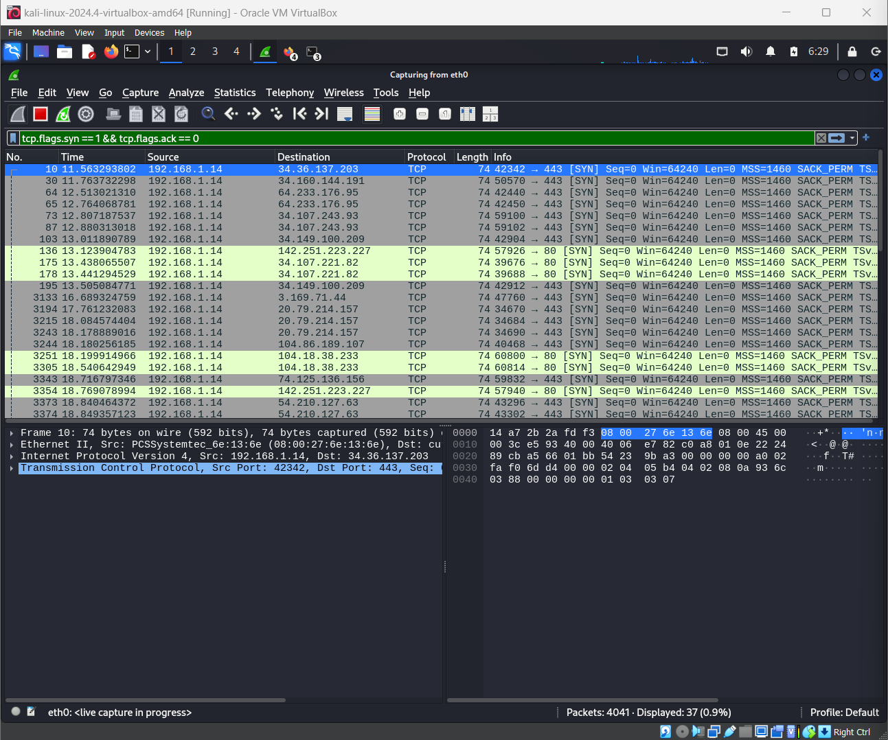

# CyberSecurity_Internship_Elevate_labs
# TASK_1:Local Network Open Port Scan
## Objective: Learn to discover open ports on devices in your local network to understand network exposure

## Tools Used
- Nmap 7.95 
- Wireshark – For capturing and analyzing network traffic
- Kali_linux- Terminal

##  IP Scanned

- Local IP Address: 192.168.1.14
- Subnet Range: 192.168.1.0/24

---

###  Command Used:

ifconfig 192.168.1.14

nmap -sS 192.168.1.0/24 -oN scan_results.txt

---

### Findings
5 hosts responded within the scanned subnet.

Device 192.168.1.1 had several open ports, including:

Port 21 – ftp

Port 22 -SSH

Port 80 – HTTP

Port 443 - HTTPS

port 5357 -WSDAPI

Other hosts had mostly filtered or closed ports with no significant exposure.

---

##  Screenshots
 ### 📡 IP of Host device  

### 🔍 Nmap Scan Output  

###  Wireshark SYN Filter  

 ---

### Wireshark SYN Packet Filter
Filter used:

tcp.flags.syn == 1 && tcp.flags.ack == 0

---

### Conclusion
This task provided hands-on experience in scanning a local network and analyzing the underlying traffic. It helped:

Identify potentially vulnerable services.

Understand how SYN scans operate at the packet level.

Reinforce the importance of reducing exposed ports to enhance network security.
